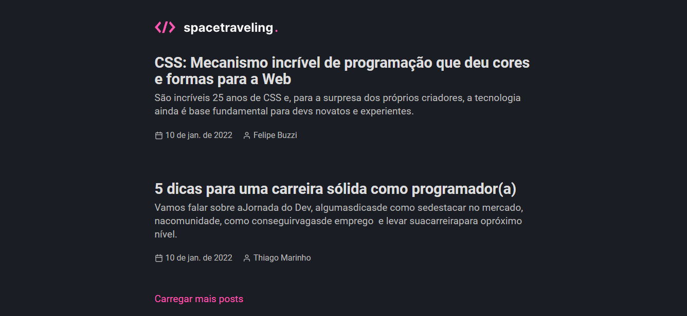

<h1 align="center">
  
</h1>

<h1 align="center">
    ig.News - Next.js
</h1>
<p align="center">Newsletter subscription application with payment via stripe</p>

<p align="center">
 <a href="#sobre-o-projeto">About the project</a> •
 <a href="#tecnologias">Technologies</a> •
 <a href="#configurações-necessárias">Required settings</a> •
 <a href="#licença">Liscence</a> •
 <a href="#autor">Author</a>
</p>

## About the project

- This blog was a project developed during a Rocketseat Ignite challenge! The idea was to develop an application from scratch, from the front-end to the connection with Prismic CMS for the publication of posts.

&nbsp;

## 💻 What's in the project?

- Very clean front-end, developed following the proposal in [Figma](https://www.figma.com/file/0Y26j0tf1K2WB5c1ja5hov/Desafios-M%C3%B3dulo-3-ReactJS?node-id=0%3A1) .
- Integration with Prismic CMS, to work with every part of the blog system.
- Integration with Prismic's Preview system, where it is possible to see an unpublished post within the blog, even before it goes live.
- Use of Next.js static system, where posts are kept in cache for better loading.
- Commenting system using Utteranc.



&nbsp;

The project was developed as a practice of module 03 classes of the [Ignite da Rocketseat](https://rocketseat.com.br/)

---

## Technologies

Below are the technologies used to build the application

- [ReactJS](https://reactjs.org/)
- [NextJS](https://nextjs.org/)
- [TypeScript](https://www.typescriptlang.org/)
- [SASS](https://sass-lang.com/)
- [Prismic CMS](https://prismic.io/)

---

## Required settings

### **Requirements**

Necessary to carry out the installations:

- [Git](https://git-scm.com/)
- [Yarn](https://classic.yarnpkg.com)

Create account and configure external services:

- [Prismic CMS](https://prismic.io/)

_Services settings are located in the servicesConfig.md file at the root of the project._

### **Project clone**

```bash
# Run the git clone command to clone the repository
$ git clone https://github.com/GabrielTSR/reactjs-blog-spacetraveling.git
# Enter the cloned repository folder
$ cd ignews
```

### **Starting the project**

```bash
# Run yarn to install dependencies
$ yarn

# At the root of the project create a copy of the .env.local.example file
# Change the copy name to .env.local
# Fill in the environment variables according to the instructions
$ cp .env.local.example .env.local

# To start the application
$ yarn dev

```

---

## License

Distributed under the MIT license. See [LICENSE](LICENSE) for more information.

---

## Author

Made by Gabriel Tavares 👋🏽 Get in touch!

[](https://www.linkedin.com/in/gabrieltsr/)
[](mailto:gabrielalvesrocha22@gmail)
